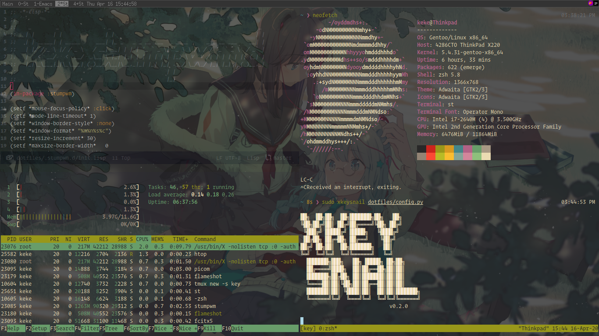

# My DotFiles
## ScreenShot

## Details
* OS:Void Linux
* SHEEL:Fish
* WM:DWM
* WMBAR:Conky
* TERMINAL:ST
* FILEMANAGER:Ranger
* EDITOR:Emacs
* BROWSER:FireFox
* LAUCH:Dmenu
* IMGVIEW:Sxiv
* SCREENSHOT:Scrot
* FONT:[Cascadia Code](https://github.com/microsoft/cascadia-code)
* CHINESE_FONT:WenQuanYi Micro Hei
